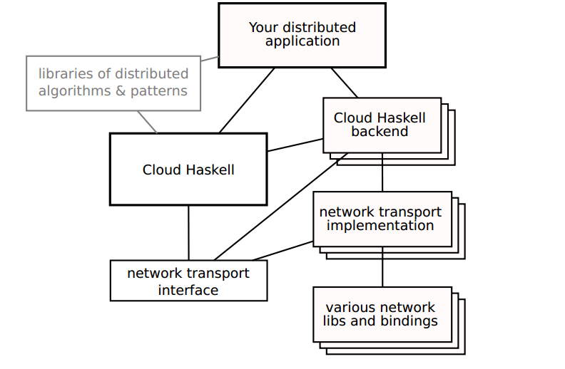

% Assignment 1
% Pankaj More
% Y9227402

Architecture Diagram
====================

Description
===========

Looking at it from a 4+1 viewset perspective, it can be called as a development view for CloudHaskell. 

The diagram talks about the decomposition of the sotware into its modules(packages) and their compile-time dependencies. As we go from top to bottom, the abstraction decreases. The boxes represent individual components of a typical distributed application using CloudHaskell. Components with multiple cascading boxes imply that there can be multiple such components with same functionality. Components with faded boxes imply that those components don't exist yet. The connectors used signify only one way compile time dependencies. If two components are connected by a line, the higher component depends on the lower component(usually but not for always)  but not vice-versa.

It says that your distrubed application will depend only(import as modules during implementation) on the following 3 types of things. 

* Higher level libraries of distributed algorithms and pattterns.
* Cloud Haskell Api(uniform, single API) which might use any of the backend implementations of CloudHaskell library.
* CloudHaskell Backend Modules(for finer control over the features of a backend which cannot be done through the uniform api with a possible reduction in the ability to swap backends).

Libraries of Distributed Algorithims will only depend on the CloudHaskell Unified API. 

CloudHaskell Backend will depend on CloudHaskell Unified API. Not clear whether it really is true and why such dependency is needed.Actually it must be the other way around. The diagram is ambigous about this point. It will depend on Network Transport Interface and on their various possible backends for greater control. This style is similar to the dependency style followed by the main distributed application discussed above.

The Unifed CloudHaskell Interface can use any one of the several candidate implementations internally. It will also depend on the network transport interface for API calls realted to connection establishment and networking related logic.

Network Transport Interface will only depend on the various implementations for different network transport protocols. It just acts as a wrapper and exposes a unified API for those different implementations.

Network Transport Implementation will only depend on the network libraries and bindings for performing various system calls.

This architecture is mostly a layered architecture with mostly components interacting in neighbouring layers and not much interaction across mulitple layers. The deisgn decision in this version of architeture might change in future. There is a deliberate design decision to not allow CloudHaskell API to depend on the internal network transport implementation. Maybe because such additional dependency is not required and would lead to unnecessary extra complexity. If an application developer needs fine-tuning over individual network protocols, he can do it via custom cloud Haskell backends which would expose(depend on) those network parameters.

Stakeholders
============  

* Project Manager - for deciding who should work on which component.
* Cloud Haskell Library Developers/Maintainers - for understanding the dependencies between various components how their code would affect other components.
* Application Developers - To be able to understand which modules to import for which scenarios.