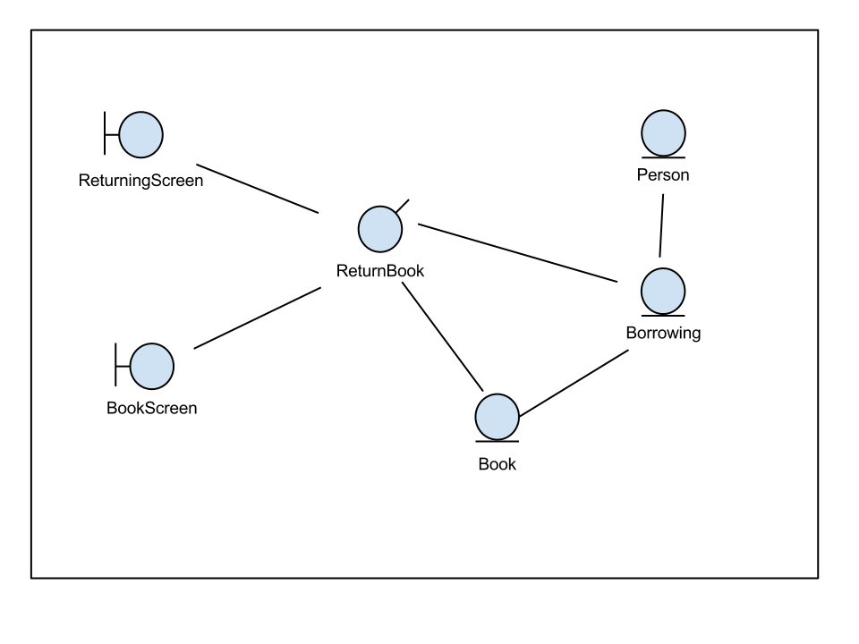

% RDD Assignment
% Pankaj More (Y9227402)
% 7th Feb, 2013

Use Case
--------
Name 
:    Return a book
Actor 
:    *primary* librarian
Trigger
:    The librarian launches the return function
 
Basic flow  
----------
1. The system displays the main screen of the return function 
2. The librarian scans the bar code of the book 
3. The system retrieves the corresponding book from the database, displays the borrowers' information and asks for confirmation 
4. The librarian validates the information 
5. The system records the book return by updating the borrowing with the return information 

DOM: Borrowing, Book and Person
-------------------------------

+----------------------+------------------------+
|Borrowing             |                        |
+======================+========================+
|Manage borrowing date |                        |
|                      |                        |
+----------------------+------------------------+
|Knows the borrower    |Person                  |
|                      |                        |
+----------------------+------------------------+
|Knows the book        |Book                    |
|                      |                        |
+----------------------+------------------------+

+----------------------+------------------------+
|Book                  |                        |
+======================+========================+
|Responsibilities      |Collaborators           |
|                      |                        |
+----------------------+------------------------+
|Knows the book's      |                        |
|details               |                        |
+----------------------+------------------------+

+----------------------+------------------------+
|Person                |                        |
+======================+========================+
|Knows the person's    |                        |
|details               |                        |
+----------------------+------------------------+
|Knows its borrowings  |Borrowing               |
+----------------------+------------------------+
                        

Analysis
========

Analysis - 1 : The system displays the main screen of the return function
--------   

1. Which object is responsible for displaying the main screen?
* Control Object (ReturnBook) 

2. What object must it collaborate with?
*  Boundary Object (ReturningScreen)

Analysis - 2 : The librarian scans the barcode of the book
--------

1. Which object is capturing the barcode scan? 
* Boundary Object (ReturningScreen)

2. Any collaboration? Let's see!

Analysis - 3 :  The system retrieves the corresponding book from the database, displays the borrowers' information and asks for confirmation 
------

1. What object is responsible for displaying the borrowers' information? 
* BookScreen

2. Where does it retrieves the book details from?
* By asking ReturnBook 

3. Could ReturnBook provide the information alone?
* No, it must collaborate with DOM entity that knows the information i.e Book

Link 2-3  
------ 
1. We now know that the ReturningScreen must collaborate with ReturnBook to display the book information via BookScreen.

Analysis - 4 : The librarian validates the information 
------

1. What object is capturing the confirmation by the librarian
* ReturningScreen

2. What does it do with this confirmation? Lets see! 

Analysis - 5 : The system records the book return by updating the borrowing with the return information 
------

1. Who records the book return?
* The return is recorded in the Borrowing entity by setting the date for the return field.
* The interface must not collaborate with entity object i.e Borrowing. So, it collaborates with ReturnBook which updates the return field of Borrowing.

CRC Cards
=========

+-------------------------------+------------------------------+
|ReturnBook                     |                              |
+===============================+==============================+
|Launches the main screen       |ReturningScreen               |
|                               |                              |
+-------------------------------+------------------------------+
|Retrieves a book from its      |Book                          |
|number                         |                              |
+-------------------------------+------------------------------+
|Launches the display of the    |BookScreen                    |
|book information               |                              |
+-------------------------------+------------------------------+
|Records the return date        |Borrowing                     |
|                               |                              |
+-------------------------------+------------------------------+

+---------------------------------+-----------------------------+
|ReturningScreen                  |                             |
+=================================+=============================+
|Captures barcode scan and        |ReturnBook                   |
|launches book information display|                             |
|                                 |                             |
+---------------------------------+-----------------------------+
|Captures confirmation from       |ReturnBook                   |
|librarian and ask for recording  |                             |
|the book return                  |                             |
+---------------------------------+-----------------------------+

+----------------------------+----------------------------+
|BookScreen                  |                            |
+============================+============================+
|Display Book information    |ReturnBook                  |
|                            |                            |
+----------------------------+----------------------------+
|Display a validation query  |ReturnBook                  |
+----------------------------+----------------------------+

Analysis Model
--------------

